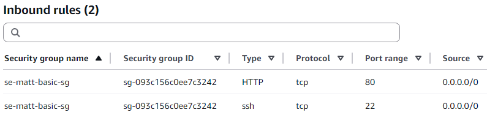

# AWS EC2 instance

Ubuntu Linux is used as it is:

- Secure
- Efficient
- Open source
- Industry standard

## Launching an EC2 instance

1. Login to AWS console
2. EC2 > Key pairs > Create key pair (If not done before)
   - Set name, RSA, .pem
   - Move .pem file to ~/.ssh
3. EC2 > Instances > Launch instances
   - Set name
   - AMI = Ubuntu 24.04
   - Instance Type = t3.micro
   - Kay pair: Reuse your key pair (search by name)
   - Reuse your SG (se-yourname-basic-sg)
     

## Connect to EC2 instance

- EC2 > Instances > (Instance ID) > Connect
- `ssh -i ~/.ssh/se-matt-key-pair.pem ubuntu@(hostname)`

## Deploy Nginx web server:

- `sudo apt update -y`
- `sudo apt upgrade -y`
- `sudo apt install nginx -y`
- Check in terminal with `sudo systemctl status nginx`, quit to terminal (if needed) with `q` or `ctrl-c`
- Check at public IP address via HTTP in browser
