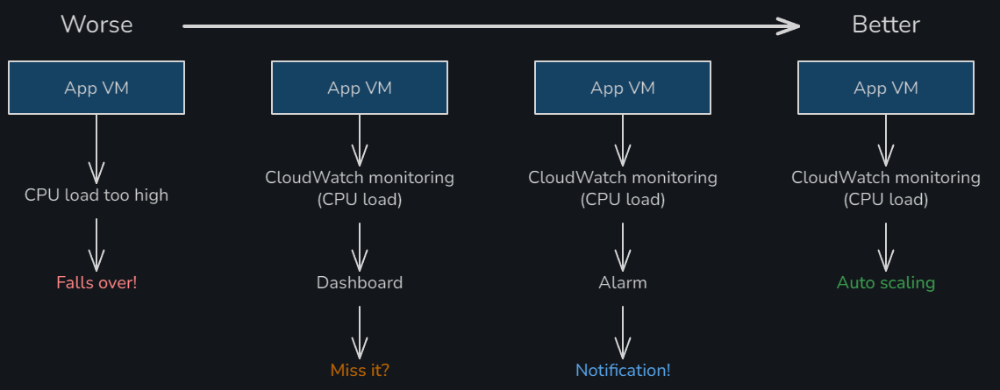

## Running scripts

Can run a script with

- `./script.sh` (needs permissions)
- `source script.sh`
- `bash script.sh`

## Images

Create an image from an existing EC2 instance, to be used to create further identical instances:

- Actions > Image and templates > Create image

(Once created)

- Create instance
  - Name: se-matt-mongodb-from-image
  - AMI: se-matt-mongodb-image

## Monitoring

In EC2 instances:

- Actions > Monitor and troubleshoot > Manage detailed monitoring
- Tick 'Enable'

In CloudWatch:

- Dashboards > Create dashboard
- Cancel
- Add Widget, Line, Next
- Search by instance id
- Search by CPU
- EC2 Per-Instance Metrics > CPUUtilization
- Custom time frame (3 mins)
- Create widget
- Add second widget for NetworkIn and NetworkOut
