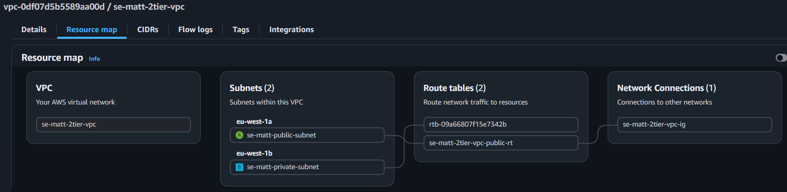

# Creating a VPC

## VPC

- AWS Console > VPC Dashboard > Create VPC
- Create VPC:
  - VPC settings:
    - Resources to create: VPC only
    - Name tag: se-matt-2tier-vpc
    <!-- (Two tiers are app and db) -->
    - IPv4 CIDR block: IPv4 CIDR manual input
    - IPv4 CIDR: 10.0.0.0/16
    - IPv6 CIDR block: No IPv6 CIDR block
    - Tenancy: Default
    - VPC encryption control: None
  - Tags:
    - Key: Name
    - Value: se-matt-2tier-vpc
  - Create VPC

## Subnet

- Subnets > Create subnet
- Create subnet:
  - VPC
    - VPC ID: Search for 'se-matt-2tier-vpc'
  - Subnet Settings:
    - Subnet 1:
      - Subnet name: se-matt-public-subnet
      <!-- ('se-matt' optional given scope) -->
      - Availability Zone: Europe (Ireland) / euw1-az3 (eu-west-1a)
      - IPv4 subnet CIDR block: 10.0.2.0/24
      - Tags:
        - Key: Name
        - Value: se-matt-public-subnet
    - Subnet 2:
      - Subnet name: se-matt-private-subnet
      <!-- ('se-matt' optional given scope) -->
      - Availability Zone: Europe (Ireland) / euw1-az1 (eu-west-1b)
      - IPv4 subnet CIDR block: 10.0.3.0/24
      - Tags:
        - Key: Name
        - Value: se-matt-private-subnet
  - Create subnet

## Gateway

- Internet gateways > Create internet gateway
- Create internet gateway:
  - Name tag: se-matt-2tier-vpc-ig
  - Create internet gateway
- Actions - Attach to VPC
- Attach to VPC:
  - Available VPCs: Search for 'se-matt-2tier-vpc'
  - Attach internet gateway

## Route table

- Route tables > Create route table
- Create route table:
  - Route table settings:
    - Name: se-matt-2tier-vpc-public-rt
    - VPC: Search for 'se-matt-2tier-vpc'
  - Create route table
- Subnet associations tab > Explicit subnet associations: Edit subnet associations
  - Tick 'se-matt-public-subnet'
  - Save associations
- Routes > Edit routes
  - Add route
  - Destination: 0.0.0.0/0
  - Target: Internet Gateway - se-matt-2tier-vpc-ig
  - Save changes

## Check setup

- Your VPCs
- Your VPCs: Search for 'se-matt-2tier-vpc'
- Resource map
  

## Deploy instances

### Database

- EC2 > Instances > Launch instances
- Launch an instance:
  - Name: se-matt-db-in-private-subnet
  - AMI: My AMIs - Search for 'se-matt-mongodb-image'
  - Instance type: t3.micro
  - Key pair: Search for 'se-matt-key-pair'
  - Network settings > Edit
    - VPC: Search for 'se-matt-2tier-vpc'
    - Subnet: se-matt-private-subnet
    - Auto-assign public IP: Disable
    - Firewall (security groups): Create security group
    - Security group name: se-matt-mongodb-private-subnet-sg
    - Description: se-matt-mongodb-private-subnet-sg
    - Security group rule 2:
      - Type: Custom TCP
      - Port range: 27017
      - Source: 10.0.2.0/24
      - Description: Public subnet instances can access mongodb
  - Launch instance

(No public IP, private IP in 10.3.x.x)

### Application

- EC2 > Instances > Launch instances
- Launch an instance:
  - Name: se-matt-app-in-public-subnet
  - AMI: My AMIs - Search for 'se-matt-node20-app-image'
  - Instance type: t3.micro
  - Key pair: Search for 'se-matt-key-pair'
  - Network settings > Edit
    - VPC: Search for 'se-matt-2tier-vpc'
    - Subnet: se-matt-public-subnet
    - Auto-assign public IP: Enable
    - Firewall (security groups): Create security group
    - Security group name: se-matt-node20-public-subnet-sg
    - Description: se-matt-node20-public-subnet-sg
    - Security group rule 2:
      - Type: HTTP
      - Source type: Anywhere
  - Launch instance

(Public IP, private IP in 10.2.x.x)

## Deletion

Delete all components in the order below:

1. Terminate instances inside the VPC
2. Delete the Security Groups you made in the VPC
3. Delete the VPC
   - It will delete all remaining components at the same time (IG, RTs, Subnets)
