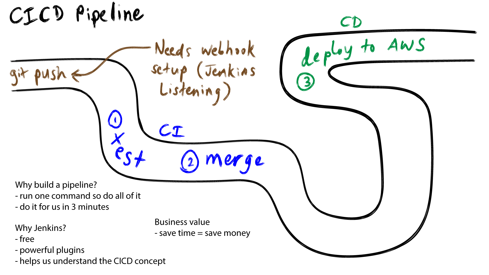

# CI/CD

## Continuous Integration

Automate: push -> test -> merge

## Continuous Delivery/Deployment

Automate the running of the **new** code

## Jenkins

1. SCM (source code management)
2. Build
3. Test
4. Package
5. Deploy/Deliver
6. Monitor

### Jobs to do

#### CI

1. SCM & build
2. Test & merge

#### CDE

3. Deploy to AWS

