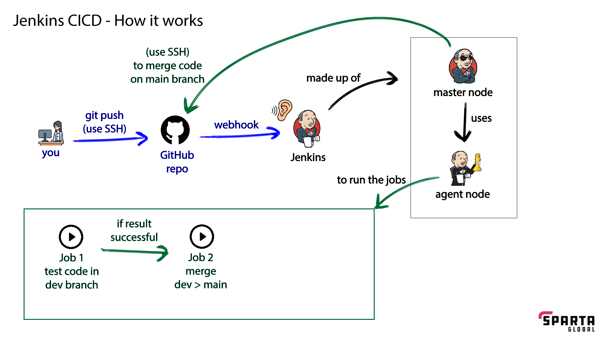
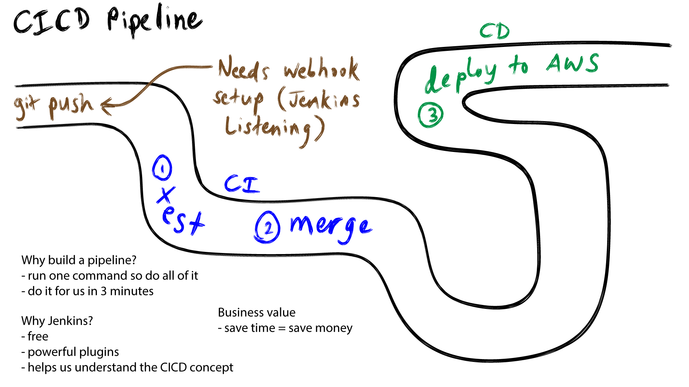
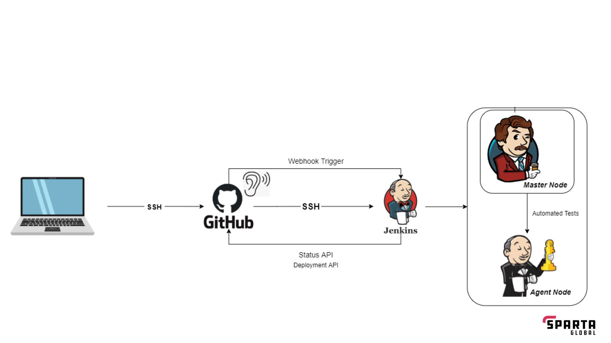

# CI/CD

## Continuous Integration

Automate: push -> test -> merge

## Continuous Delivery/Deployment

Automate the running of the **new** code

## Jenkins

1. SCM (source code management)
2. Build
3. Test
4. Package
5. Deploy/Deliver
6. Monitor

### Jobs to do

#### CI

1. SCM & build
2. Test & merge

#### CDE

3. Deploy to AWS

<!-- Pre demo points to cover in markdown:

What is CI? Benefits?
What is CD? Benefits?
Difference between CD and CDE
What is Jenkins?
Why use Jenkins? Benefits of using Jenkins? Disadvantages?
Stages of Jenkins
What alternatives are there for Jenkins
Why build a pipeline? Business value?
Create a general diagram of CICD
Understand SDLC workflow: plan, design, develop, deploy

After this please cover the three jobs we create for our pipeline in detail.

Make sure to create diagrams for each stage.

Continuous integration is the practice of regularly integrating (merging) code with the rest of the organization. It used to be common for individuals or teams to keep their code isolated in branches for many months and merge infrequently.

Continuous delivery is a philosophy and set of practices around always keeping your application in a deployable state. In order to achieve this we construct a deployment pipeline that serves to validate the correctness of changes, and deliver those changes through a series of test environments, culminating in a production deploy.

CI/CD together is the practice of merging changes frequently as devs work and having those changes pass through a series of automated tests. Upon completion those changes are bundled into a release candidate that can then be deployed automatically into production. Teams practicing CI/CD will typically produce many release candidates in one day.

So CI means continuous integration. Continuous means it's done regularly / all the time. Integration means that there is code written by different people / different companies and you need to add this in the same code base and make sure that nothing gets broken. Compiling and running automated tests are a big part of it.

You need this, because writing software is a team sport. It's easy to break software just by making a typo, and if you don't have automated tests you'll break stuff which used to work and won't find out before your customer finds out.

CD can mean continuous delivery or continuous deployment. Sometimes people build this in one pipeline, sometimes it's two different pipelines. It's not 100% clear if delivery and deployments are synonymous and it depends a lot on what kind of application you build.

For a state of the art web app, you would probably build Docker images in your delivery pipeline and deploy them to a Kubernetes in delivery pipelines. Since you need to test in different environments, you might have steps or separate pipelines to deploy to some kind of TEST environment and a PRODUCTION environment.

You need this, because you want to deploy small incremental changes often. You don't want to build for 6 months and then have a week of software installation with downtime and not knowing if it works or not in production.

If you find out your small change introduced a bug, it's easy to roll back and fix. If your big 6 month change introduces problems, how do you know where and when you made the breaking change?-->
