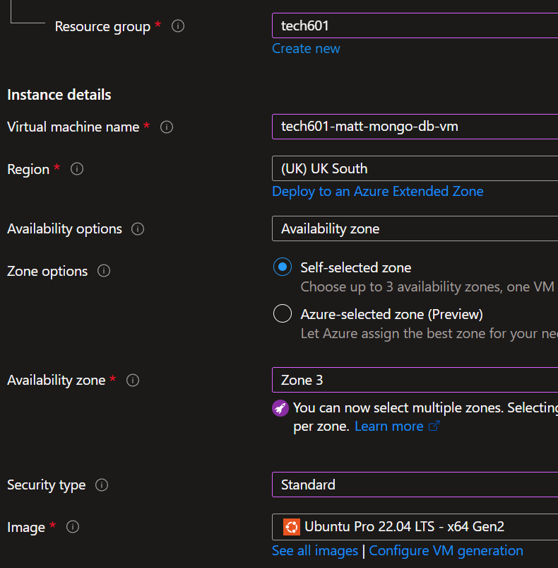
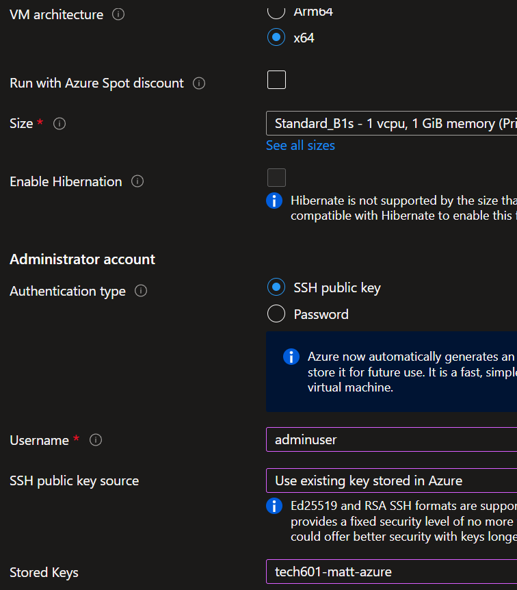
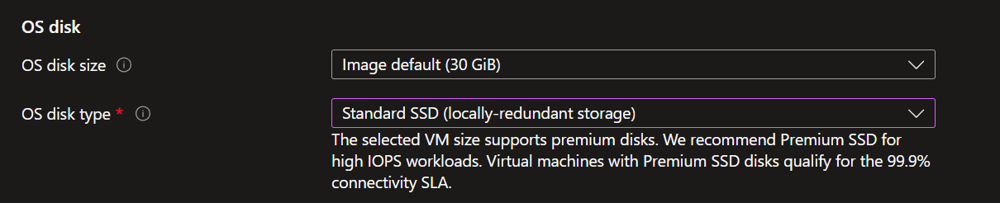
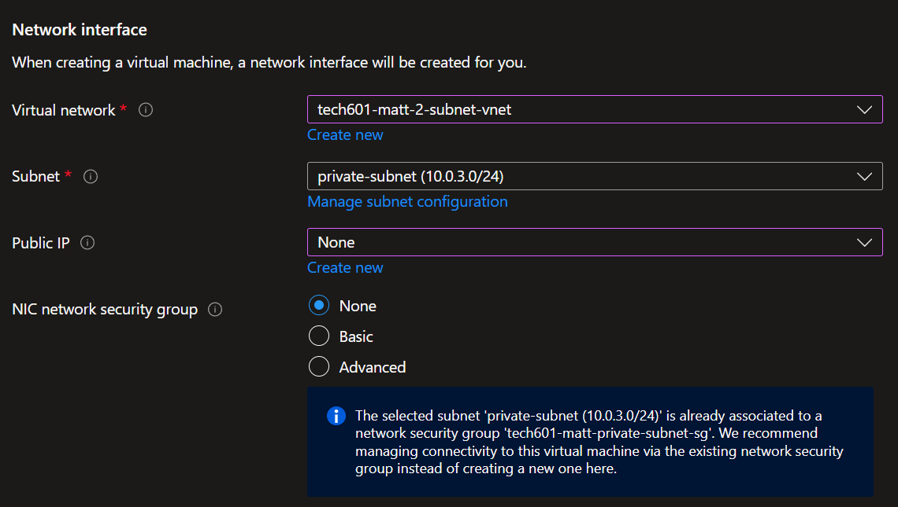
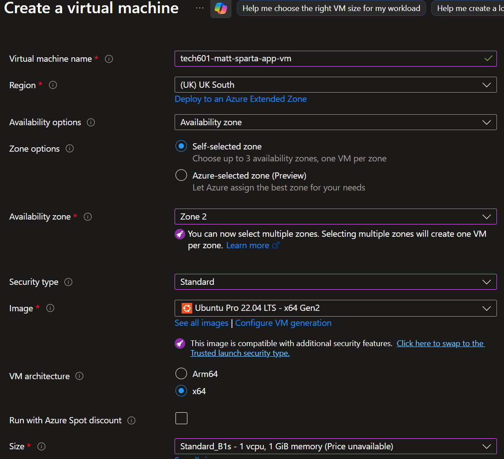
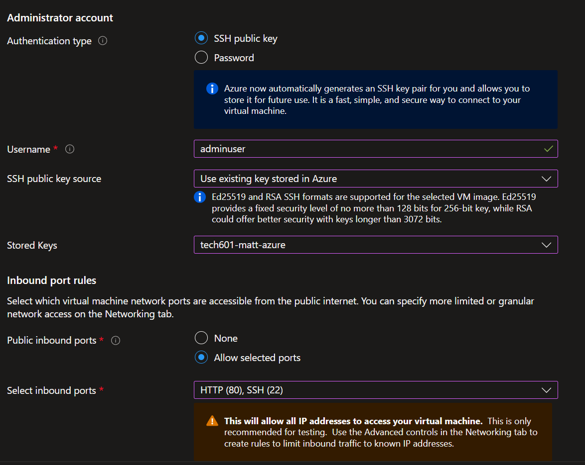
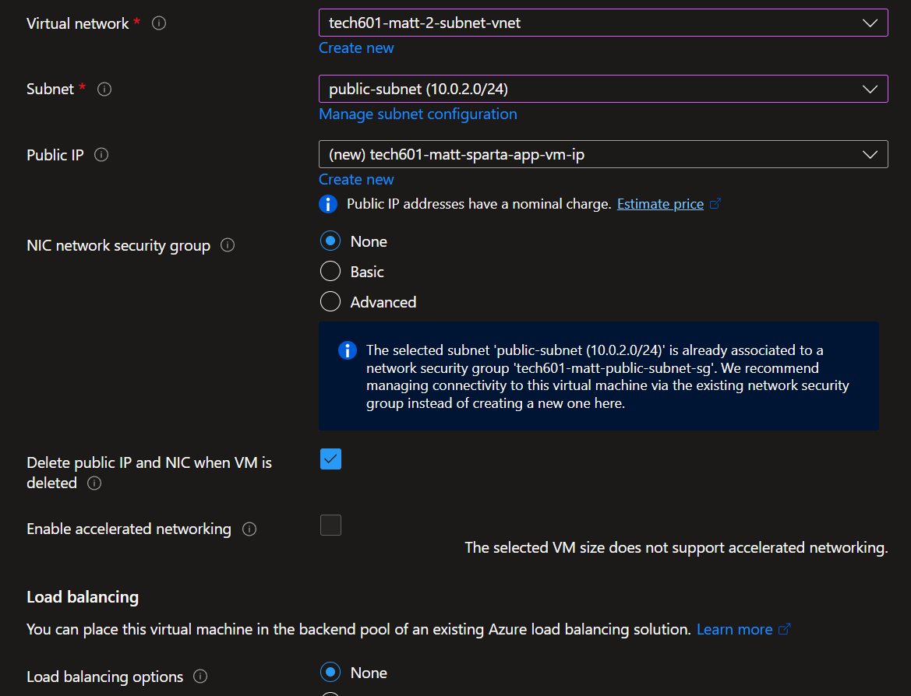

# Azure <!-- omit from toc -->

- [Virtual Machines](#virtual-machines)
  - [Manual / Bash Scripts](#manual--bash-scripts)
    - [Create VMs](#create-vms)
      - [DB VM](#db-vm)
      - [App VM](#app-vm)
    - [Commands](#commands)
      - [Manual](#manual)
        - [Optional (for startup on restart)](#optional-for-startup-on-restart)
      - [Bash Scripts](#bash-scripts)
  - [User Data](#user-data)
    - [Create VMs](#create-vms-1)
      - [DB VM](#db-vm-1)
      - [App VM](#app-vm-1)

<!-- ## Key

## Virtual Network

- [Create virtual network](https://portal.azure.com/#view/Microsoft_Azure_Network/VirtualNetworkCreateV3.ReactView)
- Basics
  - Resource group: tech601
  - Virtual network name: `tech601-matt-2-subnet-vnet`
  - Region: (UK) UK South
- Security
  - (Defaults OK)
- IP addresses
  - XXXCOMPLETE THISXXX

## SGs -->

## Virtual Machines

### Manual / Bash Scripts

#### Create VMs

##### DB VM

- [Create virtual machine](https://portal.azure.com/#create/Microsoft.VirtualMachine)
- Basics
  - Resource group: tech601
  - Virtual machine name: `tech601-matt-mongo-db-vm`
  - Region: (UK) UK South
  - Availability zone: Zone 3
  - Security type: Standard
  - Image: Ubuntu Pro 22.04 LTS - x64 Gen2
    - Search under 'canonical ubuntu 22.04'
  - Size: Standard_B1s
  - Username: `adminuser`
  - SSH public key source: Use existing key stored in Azure
  - Stored Keys: tech601-matt-azure
  - Public inbound ports: None

  
  

- Disks
  - OS disk type: Standard SSD

  

- Networking
  - Virtual network: tech601-matt-2-subnet-vnet
  - Subnet: private-subnet (10.0.3.0/24)
  - Public IP: None
  - NIC network security group: None
  - Delete NIC when VM is deleted ☑️

  

- Management
  - (Defaults OK)
- Monitoring
  - Boot diagnostics: Disable
- Advanced
  - Custom data: (blank)
- Tags
  - Owner: Matt
- Review + create, Create

##### App VM

- Create virtual machine
- Basics
  - Resource group: tech601
  - Virtual machine name: `tech601-matt-sparta-app-vm`
  - Region: (UK) UK South
  - Availability zone: Zone 2
  - Security type: Standard
  - Image: Ubuntu Pro 22.04 LTS - x64 Gen2
  - Size: Standard_B1s
  - Username: `adminuser`
  - SSH public key source: Use existing key stored in Azure
  - Stored Keys: tech601-matt-azure
  - Public inbound ports: Allow selected ports
  - Select inbound ports: HTTP (80), SSH (22)

  
  

- Disks
  - OS disk type: Standard SSD
- Networking
  - Virtual network: tech601-matt-2-subnet-vnet
  - Subnet: public-subnet (10.0.2.0/24)
  - Public IP: (new) tech601-matt-sparta-app-vm-ip
  - NIC network security group: None
  - Delete public IP and NIC when VM is deleted ☑️

  

- Management
  - (Defaults OK)
- Monitoring
  - Boot diagnostics: Disable
- Advanced
  - Custom data: (blank)
- Tags
  - Owner: Matt
- Review + create, Create

#### Commands

##### Manual

- Local:
  - ```bash
    scp -i ~/.ssh/tech601-matt-azure.pem nodejs20-sparta-test-app-2025.zip  adminuser@<app-public-ip>:~
    ```
  - ```bash
    scp -i ~/.ssh/tech601-matt-azure.pem ~/.ssh/tech601-matt-azure.pem adminuser@<app-public-ip>:~/.ssh
    ```
  - ```bash
    ssh -i ~/.ssh/tech601-matt-azure.pem adminuser@<app-public-ip>
    ```
- On app server:
  - ```bash
    sudo apt update -y
    ```
  - ```bash
    sudo apt upgrade -y
    ```
  - ```bash
    sudo apt install unzip -y
    ```
  - ```bash
    sudo unzip nodejs20-sparta-test-app-2025.zip
    ```
  - ```bash
    sudo apt install nginx -y
    ```
  - ```bash
    sudo sed -i '51c\proxy_pass http://127.0.0.1:3000;' /etc/nginx/sites-available/default
    ```
  - ```bash
    sudo systemctl restart nginx
    ```
  - ```bash
    sudo systemctl enable nginx
    ```
  - ```bash
    sudo bash -c "curl -fsSL https://deb.nodesource.com/setup_20.x | bash -"
    ```
  - ```bash
    sudo apt install nodejs -y
    ```
  - ```bash
    cd nodejs2-sparta-test-app-2025/app
    ```
  - ```bash
    npm install
    ```
  - ```bash
    sudo npm install pm2 -g
    ```
  - ```bash
    pm2 kill
    ```
  - ```bash
    pm2 --name SpartaApp start app.js
    ```
  - ```bash
    ssh -i ~/.ssh/tech601-matt-azure.pem adminuser@<db-private-ip>
    ```
- On db server:
  - ```bash
    sudo apt update -y
    ```
  - ```bash
    sudo apt upgrade -y
    ```
  - ```bash
    sudo apt install gnupg -y
    ```
  - ```bash
    sudo apt install curl -y
    ```
  - Get GPG key
    ```bash
    curl -fsSL https://www.mongodb.org/static/pgp/server-7.0.asc | \
    sudo gpg -o /usr/share/keyrings/mongodb-server-7.0.gpg \
    --dearmor
    ```
  - Create sources list file - configures how to install mongodb
    ```bash
    echo "deb [ arch=amd64,arm64 signed-by=/usr/share/keyrings/mongodb-server-7.0.gpg ] https://repo.mongodb.org/apt/ubuntu jammy/mongodb-org/7.0 multiverse" | sudo tee /etc/apt/sources.list.d/mongodb-org-7.0.list
    ```
  - ```bash
    sudo apt update -y
    ```
  - Install mongodb:
    ```bash
    sudo apt install -y mongodb-org=7.0.6 mongodb-org-database=7.0.6 mongodb-org-server=7.0.6 mongodb-mongosh=2.1.5 mongodb-org-mongos=7.0.6 mongodb-org-tools=7.0.6
    ```
  - Check version with
    ```bash
    mongod --version
    ```
  - Check status (not running)
    ```bash
    sudo systemctl status mongod
    ```
  - ```bash
    cd /etc
    ```
  - ```bash
    sudo nano mongod.conf
    ```
  - Change line
    ```
    bindIp: 0.0.0.0
    ```
  - Check with
    ```bash
    cat mongod.conf
    ```
  - ```bash
    cd
    ```
  - ```bash
    sudo systemctl start mongod
    ```
  - ```bash
    sudo systemctl enable mongod
    ```
  - ```bash
    sudo systemctl status mongod
    ```
  - ```bash
    exit
    ```
- Back on app server:
  - ```bash
    cd
    ```
  - ```bash
    sudo vim .bashrc
    ```
  - Add line:
    ```
    export DB_HOST=mongodb://<db-private-ip>:27017/posts
    ```
  - ```bash
    source .bashrc
    ```
  - ```bash
    printenv DB_HOST
    ```
  - ```bash
    cd nodejs2-sparta-test-app-2025/app
    ```
  - ```bash
    pm2 kill
    ```
  - ```bash
    node seeds/seed.js
    ```
  - ```bash
    pm2 --name SpartaApp start app.js
    ```

###### Optional (for startup on restart)

- On app server:
  - ```bash
    pm2 startup
    ```
  - (from output of command above)
    ```bash
    sudo env PATH=$PATH:/usr/bin /usr/lib/node_modules/pm2/bin/pm2 startup systemd -u adminuser --hp /home/adminuser
    ```
  - ```bash
    pm2 save
    ```

##### Bash Scripts

- Local:
  - Edit the following line in [`sparta-app-deploy.sh`](scripts/sparta-app-deploy.sh) to ensure that `<db-private-ip>` matches the IP for `tech601-matt-mongo-db-vm`:
    ```
    export DB_HOST=mongodb://<db-private-ip>:27017/posts
    ```
  - ```bash
    scp -i ~/.ssh/tech601-matt-azure.pem ~/.ssh/tech601-matt-azure.pem adminuser@<app-public-ip>:~/.ssh
    ```
  - ```bash
    scp -i ~/.ssh/tech601-matt-azure.pem sparta-app-deploy.sh adminuser@<app-public-ip>:~
    ```
  - ```bash
    ssh -i ~/.ssh/tech601-matt-azure.pem adminuser@<app-public-ip>
    ```
- On app server:
  - ```bash
    ssh -i ~/.ssh/tech601-matt-azure.pem adminuser@<db-private-ip>
    ```
- On db server:
  - ```bash
    vim mongo-deploy.sh
    ```
  - Paste in [DB build script](scripts/mongo-deploy.sh)
  - ```bash
    chmod +x mongo-deploy.sh
    ```
  - ```bash
    ./mongo-deploy.sh
    ```
  - ```bash
    exit
    ```
- Back on app server:
  - ```bash
    chmod +x sparta-app-deploy.sh
    ```
  - ```bash
    ./sparta-app-deploy.sh
    ```
  - ```bash
    exit
    ```

### User Data

#### Create VMs

##### DB VM

- Create virtual machine
- Basics
  - Resource group: tech601
  - Virtual machine name: `tech601-matt-mongo-db-vm`
  - Region: (UK) UK South
  - Availability zone: Zone 3
  - Security type: Standard
  - Image: Ubuntu Pro 22.04 LTS - x64 Gen2
  - Size: Standard_B1s
  - Username: `adminuser`
  - SSH public key source: Use existing key stored in Azure
  - Stored Keys: tech601-matt-azure
  - Public inbound ports: None
- Disks
  - OS disk type: Standard SSD
- Networking
  - Virtual network: tech601-matt-2-subnet-vnet
  - Subnet: private-subnet (10.0.3.0/24)
  - Public IP: None
  - NIC network security group: None
  - Delete NIC when VM is deleted ☑️
- Management
  - (Defaults OK)
- Monitoring
  - Boot diagnostics: Disable
- Advanced
  - Custom data: (paste [DB build script](scripts/mongo-deploy.sh))
- Tags
  - Owner: Matt
- Review + create, Create

##### App VM

- Create virtual machine
- Basics
  - Resource group: tech601
  - Virtual machine name: `tech601-matt-sparta-app-vm`
  - Region: (UK) UK South
  - Availability zone: Zone 2
  - Security type: Standard
  - Image: Ubuntu Pro 22.04 LTS - x64 Gen2
  - Size: Standard_B1s
  - Username: `adminuser`
  - SSH public key source: Use existing key stored in Azure
  - Stored Keys: tech601-matt-azure
  - Public inbound ports: Allow selected ports
  - Select inbound ports: HTTP (80), SSH (22)
- Disks
  - OS disk type: Standard SSD
- Networking
  - Virtual network: tech601-matt-2-subnet-vnet
  - Subnet: public-subnet (10.0.2.0/24)
  - Public IP: (new) tech601-matt-sparta-app-vm-ip
  - NIC network security group: None
  - Delete public IP and NIC when VM is deleted ☑️
- Management
  - (Defaults OK)
- Monitoring
  - Boot diagnostics: Disable
- Advanced
  - Custom data: (paste [Sparta app build script](scripts/sparta-app-deploy.sh); ensure `DB_HOST` matches DB private IP)
- Tags
  - Owner: Matt
- Review + create, Create

<!-- Run the command: Execute sudo waagent -deprovision+user -force inside the guest OS.
Stop the VM: Shut down the VM from the Azure portal or CLI to ensure data consistency.
Capture the Image: Use the Azure Portal or Azure CLI to capture the deprovisioned VM.  -->
